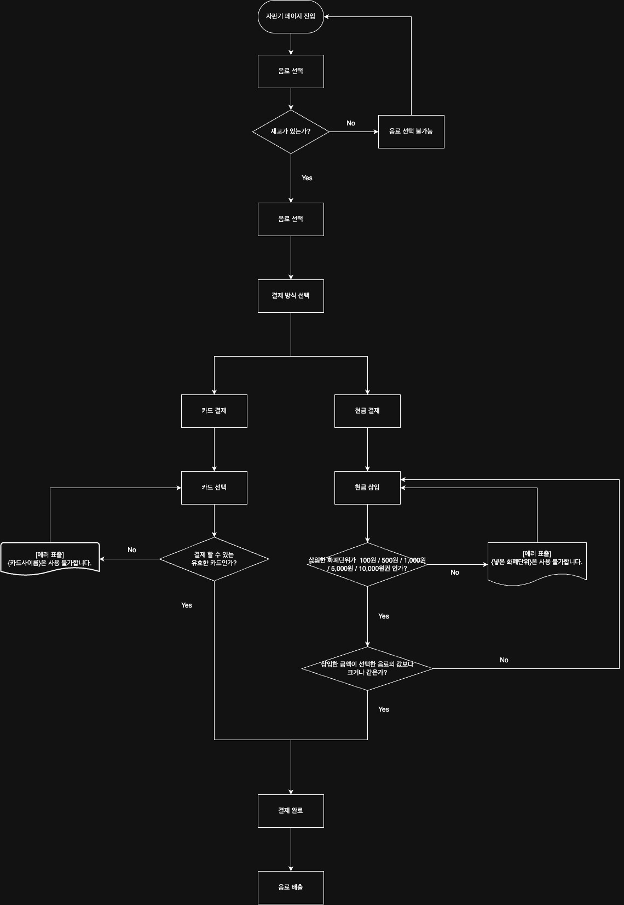

# Vending-Machine

React + TypeScript로 구현한 간단한 자판기 시뮬레이션입니다.  
음료 선택, 카드/현금 결제, 재고 관리, 거스름돈 반환 등의 기능이 포함되어 있습니다.



## 실행 방법

```bash
# 패키지 설치
npm install

# 로컬 개발 서버 실행
npm run dev
```

## 프로젝트 버전

- Version: 1.0.0
- Last Update: 2025-06-26

## 주요 기능

- 음료 선택 및 재고 확인
- 카드사 선택 → 유효 카드 검증
- 현금 단위 선택 → 누적 계산 + 거스름돈 반환
- 재고 소진 시 선택 불가 처리
- 상태 흐름: drink 선택 → 결제 방식 선택 → 결제 → 배출(dispensing)

## 발생 가능한 케이스에 대한 기록

### 1. 재고 소진

- 재고가 0인 경우, 음료 선택 버튼이 비활성화됩니다.

### 2. 유효하지 않은 카드

- 유효하지 않은 카드가 선택되면, alert처리 됩니다.

### 3. 유효하지 않은 현금

- 유효하지 않은 현금이 선택되면, alert처리 됩니다.

### 4. 투입된 현금이 부족한 경우

- 투입된 현금이 부족한 경우, 바로 결제 처리 되지않고, 추가 투입을 요구합니다.

### 5. 결제완료 시 거스름돈 계산 및 반환

- 결제완료 시 거스름돈이 발생할 경우, 화면에 표시됩니다.

### 6. 음료 제공 후 재고 반영

- 음료가 제공된 후, 재고가 감소됩니다.
